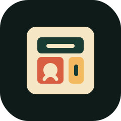

<div align="center">
  
  <h1>Personal CRM</h1>
  <p><b>A local-first SaaS-style relationship workspace with web, mobile, desktop, API, agents, memory, and Docker orchestration.</b></p>
  <a href="https://github.com/kiwigitops/Personal-CRM/stargazers"></a>
  <a href="https://github.com/kiwigitops/Personal-CRM/actions/workflows/ci.yml"></a>
  
  
</div>

<br/>

## Why

Personal CRM helps you keep relationships warm without turning people into tasks. It tracks contacts, companies, notes, interactions, reminders, tags, relationship strength, and suggested next actions in one workspace.

The project is a full-stack monorepo built to feel like a real product, not a scaffold. It includes a polished web app, native-oriented mobile shell, Linux desktop shell, auth-aware API, PostgreSQL schema, Redis-backed jobs, CRM intelligence agents, memory summaries, seed data, observability, and Dockerized local development.

## Features

| Area | What is included |
| :--- | :--- |
| CRM | Contacts, companies, tags, notes, timelines, follow-ups, saved filters, CSV import/export, dedupe suggestions |
| Intelligence | Relationship briefs, warmth scoring, stale-contact detection, next-best-action suggestions, deterministic demo seeding |
| Apps | Next.js web app, Expo mobile app, Tauri Linux desktop shell, shared UI/types/API client packages |
| Backend | Versioned REST API, auth, RBAC, workspace membership, Prisma/PostgreSQL, OpenAPI docs, audit trail |
| Platform | Docker Compose stack with reverse proxy, API, web, agents, PostgreSQL, Redis, MailHog, MinIO, Prometheus, Grafana |

## Run Locally

```powershell
cd personal-crm-platform
docker compose up --build -d
node .\scripts\reset-demo.mjs
```

Then open [http://localhost:8080](http://localhost:8080).

Demo login:

```text
Email: owner@personal-crm.local
Password: password123
```

Useful local URLs:

| Service | URL |
| :--- | :--- |
| Web app | http://localhost:8080 |
| API docs | http://localhost:8080/api/docs |
| API health | http://localhost:8080/api/v1/health/ready |
| Agents health | http://localhost:4100/health/ready |
| MailHog | http://localhost:8025 |
| Grafana | http://localhost:3001 |
| Prometheus | http://localhost:9090 |
| MinIO console | http://localhost:9001 |

## Workspace

| Path | Purpose |
| :--- | :--- |
| `personal-crm-clients` | Web, mobile, desktop, and shared frontend packages |
| `personal-crm-api` | REST API, auth, CRM modules, Prisma schema, seed data, and tests |
| `personal-crm-agents` | Queue-driven CRM intelligence agents and memory providers |
| `personal-crm-platform` | Docker Compose, reverse proxy, observability, scripts, and deployment assets |
| `personal-crm-docs` | Architecture, setup, deployment, data model, API, memory, agents, and ADR docs |

## Development

```powershell
# API
cd personal-crm-api
npm install
npm run test
npm run build

# Agents
cd ..\personal-crm-agents
npm install
npm run test
npm run build

# Clients
cd ..\personal-crm-clients
npm install
npm run test
npm run build:web
```

See the docs for deeper setup and operations:

| Document | Link |
| :--- | :--- |
| Architecture | [personal-crm-docs/architecture-overview.md](personal-crm-docs/architecture-overview.md) |
| Local development | [personal-crm-docs/local-development.md](personal-crm-docs/local-development.md) |
| Deployment | [personal-crm-docs/deployment.md](personal-crm-docs/deployment.md) |
| Data model | [personal-crm-docs/data-model.md](personal-crm-docs/data-model.md) |
| Agents and skills | [personal-crm-docs/agents-and-skills.md](personal-crm-docs/agents-and-skills.md) |
